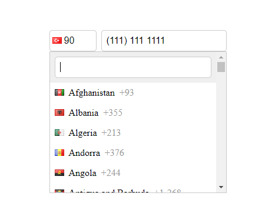

# phoneInput

Simple way to show, modify and format phone number input.

> Warning: This class is not provide data validation on client side.

* Country list taken from https://countrycode.org/, there may be discrepancies or omissions, data accuracy has not been tested.
* Country flag sprite taken from https://flag-sprites.com/, there may be discrepancies or omissions, data accuracy has not been tested.

#### Example Screenshot



### Usage

```html
<link rel="stylesheet" href="assets/phone-input-ui.min.css">
<link rel="stylesheet" href="assets/flags.css">
```

```html
<!-- This usage generates country code and list parts automatically. -->
<input type="tel" name="mobile-number" id="mobile-number" required>
```

or if you want to show specific country and code from your data;

> Warning: When only the _country_code is provided, different flags may appear due to countries that use the same code. For example, both Canada and the United States have a country code of "1". A better option is to use ISO Alpha 2 Codes for accuracy.

```html
<input type="tel" name="mobile-number" id="mobile-number" value="(111) 111 1111" required>
<!-- Country code id should be input id + _country_code -->
<!-- This will allow you to enter code value from your data -->
<input type="text" name="mobile-number_country_code" id="mobile-number_country_code" value="90" required> 
<!-- Country ISO id should be input id + _iso -->
<!-- This will allow you to enter iso value from your data -->
<input type="text" name="mobile-number_iso" id="mobile-number_iso" value="TR">
```

```html
<script src="assets/phoneinput.min.js"></script>
<script>
    new PhoneInput("mobile-number", {
        defaultCountry: "TR" //ISO Alpha 2
    });
</script>
```

### Expected Output From Given Data Example
[Screenshot](#example-screenshot)
```html
<div class="phone__input">
    <div class="country__code">
        <div class="selected__flag">
            <div class="fg flag flag-tr"></div>
        </div>
        <input type="text" name="mobile-number_country_code" id="mobile-number_country_code" value="TR" required="" class="country__code__input" readonly="" autocomplete="off">
    </div>
    <input type="text" name="mobile-number-iso" id="mobile-number_iso" value="TR" class="country__iso__input" readonly="" autocomplete="off">
    <ul class="country__list" style="display: none;">
        <li class="country__search__container"><input class="search__on__list" autocomplete="off"></li>
        <li class="country__list__item">
            <div class="flag flag-af"></div>
            <div class="country-name">Afghanistan</div>
            <div class="country-code">+93</div>
        </li>
        <!-- List continues like the above list item -->
    </ul>
    <input type="tel" name="mobile-number" id="mobile-number" value="(111) 111 1111" required="" autocomplete="off">
</div>
```

#### Data Priority

If you want to show specific country from your data, setting country priorities are;

| Priority (High to Low)  |     Type (for detect the given country)      |
|:-----------------------:|:--------------------------------------------:|
|            1            |          ISO (from id + _iso input)          |
|            2            | Country Code (from id + _country_code input) |
|            3            |     Default Country (from class options)     |

#### Optional Settings

```html
<script>
    new PhoneInput("mobile-number", {
        defaultCountry: "TR", //this sets default country by ISO Alpha 2 Codes. when list loaded this country selected automatically if you dont give country code to related input
        plusSign: true, //puts '+' at the beginning of country code
        autoComplete: false, //allows input to be able autocomplete. autocomplete: true may corrupt formatting on input
        customMessage: 'Please enter your phone number correctly.' //this text will be shown when input is not valid
    });
</script>
```